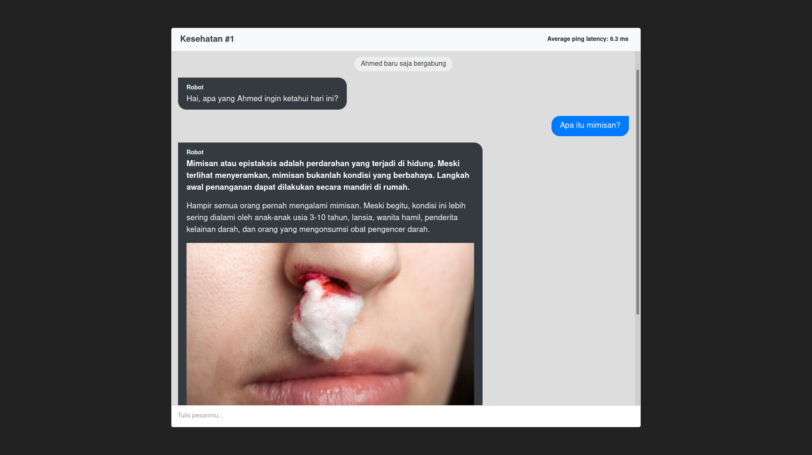

# (Medical) Chatbot

This project is meant to start learning how to build a reliable medical chatbot.



## Background

I am very aware that a chatbot cannot replace the role of a doctor, no matter how good it is. Therefore, I only intend to insert the chatbot into the same chat room as the client, to help doctors answer common problems.

## How to run

Assuming that you have `docker` installed on your system, you can build, install, and then run this project by executing the following commands.

```bash
docker-compose up -d
docker-compose exec app npm install
# docker-compose exec app npm run build
```

Lastly, open your browser and go to [http://localhost:8080](http://localhost:8080).

## How to test

You can ask the robot about anything related to disease. Unfortunately, the robot is currently only able to understand most questions that begin with "apa" ("what" in Indonesian), such as (but not limited to):

- Apa itu diare?
- Apa itu ngantuk?
- Apa gejala flu burung?
- Bagaimana mengobati diabetes?

## Technology stack

The application has built using:

- Vue.js version 2.6.11
- Node.js version 14.15.5
- Python version 3.8
- Flask version 1.1.2

and has been successfully deployed locally on:

- Fedora 33 Workstation
- Linux kernel 5.10.13-200.fc33.x86_64
- Docker version 19.03.13 build 4484c46
- Docker Compose version 1.27.4

## Acknowledgment

Despite being not legal, the dataset used in this application is obtained through web crawling and scraping from the [alodokter.com](alodokter.com) website. Feel free to explore the dataset [here](db).
